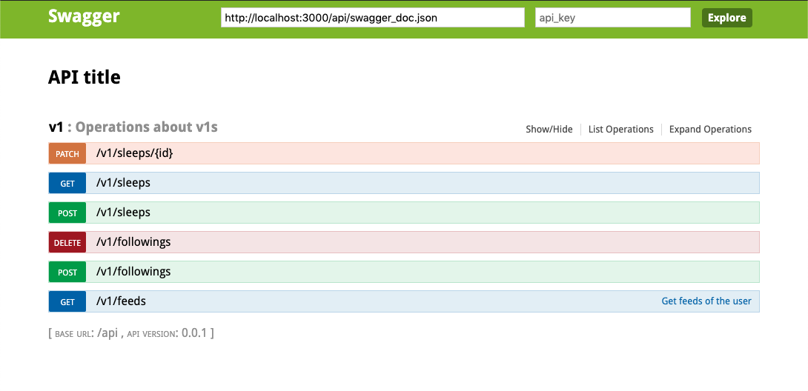

# Good Night!

Let users track when they go to bed and when they wake up!

There are some restful APIS to achieve the following:

1. Clock In operation, and return all clocked-in times, ordered by created time.
1. Users can follow and unfollow other users.
1. See the sleep records over the past week for their friends, ordered by the length of their sleep.

You can see the PRs in [here](https://github.com/darren987469/good_night/pulls?q=is%3Apr+is%3Aclosed)

## API document

* Development: http://localhost:3000/swagger



## Install

```shell
bundle                # install gems
rails db:setup        # create db and seed
rails s               # start server in http://localhost:300

# postgres db
brew install postgresql
brew services start postgresql
```

## Testing

```shell
bundle exec rake
```
